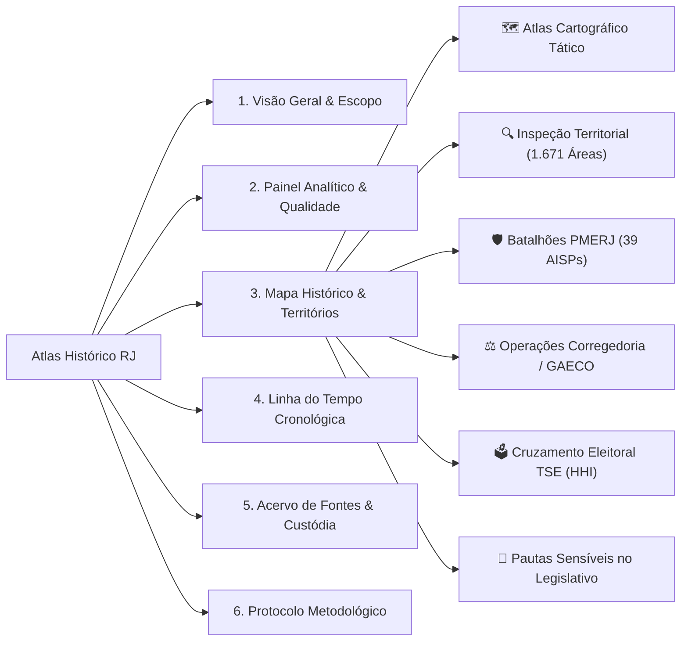

# 🏛️ Atlas Histórico, Territorial e Antropológico da Criminalidade no Rio de Janeiro

[](https://www.python.org/)
[](tests/)
[](https://streamlit.io/)
[](app/map/)
[](database/)
[](data/raw/)
[](#-aviso-ético-e-finalidade)

Projeto multidisciplinar de pesquisa científica, histórica, sociológica, antropológica e geoespacial sobre a evolução do crime organizado, das dinâmicas de controle territorial armado e das instituições de segurança pública no estado do Rio de Janeiro entre **1950 e 2026**.

O objetivo não é produzir um dashboard genérico de ocorrências, mas uma **infraestrutura de pesquisa auditável**: cada afirmação deve poder ser rastreada até a evidência documental que a sustenta, contesta ou contextualiza.

---

## 🎯 O que o projeto pretende responder

* **Gênese e Dinâmica Organizacional:** Como facções, milícias e esquadrões da morte surgiram, se estruturaram, fragmentaram ou desapareceram?
* **Transformação Territorial e Cartografia Histórica:** Como disputas, alianças e fronteiras armadas se alteraram no espaço urbano ao longo das décadas?
* **Relações Institucionais e o Estado:** Como o sistema penitenciário, as polícias, a política urbana e os poderes constituídos interagiram com essas dinâmicas?
* **Crítica de Fontes e Conflitos Historiográficos:** Como diferentes fontes descrevem os mesmos fatos e por que suas versões divergem?
* **Estatística vs. Realidade Criminológica:** Ocorrência policial registrada $\neq$ incidência real $\neq$ evento histórico $\neq$ narrativa sobre o fato.
* **Transparência Epistemológica:** O que sabemos com certeza documental, o que é inferência historiográfica e o que permanece lacuna ou desconhecido?

---

## 🔬 Princípio Central: O Claim como Unidade de Conhecimento

A unidade fundamental de conhecimento do projeto é a **afirmação atômica (`Claim`)**. Um acontecimento histórico pode conter múltiplas afirmações, e cada uma delas pode possuir fontes independentes, posturas de concordância (`apoia`), divergência (`contesta`) ou matização (`matiza`).

```text
FONTE DOCUMENTAL / DATASET
  │  (custódia digital com hash SHA-256)
  ▼
EVIDÊNCIA LOCALIZADA
  │  (página / seção / trecho literal obrigatório)
  ▼
CLAIM (Afirmação Atômica)
  │  ├── [APOIA]
  │  ├── [CONTESTA]
  │  └── [MATIZA]
  ▼
ACONTECIMENTO HISTÓRICO / ENTIDADE
  │  ├── Temporalidade explícita (intervalos sem falsa precisão)
  │  ├── Território & Geografia histórica (sem coordenadas inventadas)
  │  ├── Organizações & Atores
  │  └── Ficha Epistemológica
  ▼
LABORATÓRIO ANALÍTICO & ATLAS CARTOGRÁFICO
```

O sistema preserva estritamente:
* **Grafia original** e forma normalizada das entidades e topônimos;
* **Expressão temporal original** da fonte (`date_display`), distinguindo `dia`, `mes`, `ano`, `decada`, `aproximado` e `desconhecido`;
* **Incerteza geográfica documentada** (sem imputar centroides como locais pontuais exatos de ocorrências);
* **Distinção estrita entre ausência de dado (`NULL`) e valor zero (`0`)**;
* **Isolamento de dados técnicos de teste (`is_demo=True`)** em relação ao acervo histórico real.

---

## 🔍 Critério de Qualidade Científica (As 8 Perguntas de Auditabilidade)

O projeto prioriza **auditabilidade sobre estética superficial**. Antes de apresentar qualquer conclusão ou visualização, a plataforma deve permitir responder:

1. **Qual é exatamente a afirmação?** (Proposição atômica não ambígua).
2. **Qual documento primário ou secundário sustenta essa afirmação?**
3. **Onde no documento está a evidência?** (Página, seção e trecho literal transcrito).
4. **As fontes são de fato independentes?** (Distinguir fontes primárias de múltiplos veículos citando o mesmo boletim ou relatório policial derivado).
5. **Existem fontes que contestam ou matizam essa versão?**
6. **Qual é a precisão temporal e espacial real?** (Não transformar "1978" em "01/01/1978").
7. **Quais limitações, vieses institucionais e lacunas permanecem?**
8. **Outro pesquisador consegue reproduzir a análise a partir dos dados abertos e dos scripts versionados?**

---

## 📚 Metodologia e Protocolo de Pesquisa

* [`docs/metodologia/00_protocolo_de_pesquisa.md`](docs/metodologia/00_protocolo_de_pesquisa.md) — Protocolo científico completo: epistemologia, crítica de fontes, triangulação, anacronismo e salvaguardas éticas.
* [`docs/metodologia/08_catalogo_de_proveniencia.md`](docs/metodologia/08_catalogo_de_proveniencia.md) — Catálogo de custódia e proveniência arquivística digital (SHA-256, metadados sidecar).
* [`docs/research/agenda_pesquisa.md`](docs/research/agenda_pesquisa.md) — Agenda científica, eixos prioritários de investigação e cadernos de campo.
* [`docs/fontes/bibliografia_nucleo.md`](docs/fontes/bibliografia_nucleo.md) — Bibliografia fundamental (obras de referência da sociologia urbana e criminologia do RJ).

---

## 🗺️ O Mapa e o Atlas Histórico Editorial

A cartografia é o instrumento central de investigação e confronto espacial. A interface adota a estética de **Arquivo Histórico + Laboratório Analítico**, com tema escuro tático (*CartoDB Dark Matter*) de alto contraste e legibilidade:

```text
┌─────────────────────────────────────────────────────────────────────────────────────────────────┐
│  ATLAS HISTORIOGRÁFICO DO RIO DE JANEIRO — PAINEL DE EVIDÊNCIAS                                 │
│  [ Modo: Folium / PyDeck 3D ]   [ Camadas: AISP PMERJ + 166 Bairros + 1.671 Áreas Faveladas ]   │
├───────────────────────────────────────────────────────┬─────────────────────────────────────────┤
│                                                       │ FICHA EPISTEMOLÓGICA DO EVENTO          │
│   MAPA INTERATIVO TÁTICO (TELA CHEIA)                 │                                         │
│                                                       │ [NÍVEL A — DOCUMENTO JUDICIAL/OFICIAL]  │
│   • 166 Bairros Oficiais (PCRJ / IPP)                 │ [1979] Fundação do NuCOE / BOPE         │
│   • 39 Batalhões PMERJ (AISP / ISP-RJ)                │ Precisão: Dia (Boletim nº 014)          │
│   • 1.671 Perímetros de Facções & Milícias            │                                         │
│     - ■ Comando Vermelho (CV)                         │ O QUE SABEMOS:                          │
│     - ■ Terceiro Comando Puro (TCP)                   │ Criação do núcleo de operações...       │
│     - ■ Amigos dos Amigos (ADA)                       │                                         │
│     - ■ Liga da Justiça & Milícias                    │ CUSTÓDIA DIGITAL (SHA-256):             │
│                                                       │ 97b91fc1c855a9b891ec08d0a8...           │
│   • Pins Históricos com Selos de Evidência            │                                         │
│     [🟢 Nível A]  [🔵 Nível B]  [🟡 Nível C]  [🔴 Disputa]│ CLAIMS & CONFRONTOS HISTORIOGRÁFICOS:   │
│                                                       │ [APOIA] Histórico Oficial SEPM-RJ       │
├───────────────────────────────────────────────────────┴─────────────────────────────────────────┤
│  ⏱️ LINHA DO TEMPO CONTÍNUA: [ 1958 ══════════════════════════════════════════● 2026 ]          │
│  📥 EXPORTAÇÃO REPRODUTÍVEL: [ GeoJSON ]  [ GeoParquet ]  [ CSV ]  [ JSON de Auditoria ]        │
└─────────────────────────────────────────────────────────────────────────────────────────────────┘
```

### Principais Módulos de Investigação Integrados:
1. **Malhas Vetoriais Oficiais:**
   * **39 Áreas Integradas de Segurança Pública (AISPs):** Batalhões da PMERJ com metadados ISP-RJ.
   * **166 Bairros Oficiais do Rio:** Limites do Instituto Pereira Passos (IPP / Data.Rio).
   * **1.671 Perímetros Favelados e Comunidades:** Base vetorial em padrão RFC 7946 com metadados sidecar.
2. **⚖️ O Desafio do "Arrego" (Corregedoria & GAECO):** Grandes operações contra desvios de conduta policial com número de processo judicial e hash SHA-256.
3. **🗳️ Cruzamento Eleitoral (TSE x Batalhões):** Spatial Join e cálculo automatizado do **Índice Herfindahl-Hirschman (HHI)** para detecção de anomalias e currais eleitorais.
4. **📜 Processamento Legislativo (CMRJ & ALERJ):** Classificador NLP das pautas municipais e estaduais incidentes sobre os 5 eixos econômicos do crime organizado.
5. **📊 Laboratório Quantitativo ISP-RJ:** Matrizes de correlação e testes de hipótese criminológica com séries temporais abertas.

---

## 🏛️ As Seções do Atlas



---

## 📊 Estado Atual do Acervo e Banco de Dados

| Dimensão | Quantitativo Auditado | Padrão Metodológico |
| :--- | :---: | :--- |
| **Acontecimentos Históricos Documentados** | **46 eventos** | 100% com fontes, citações literais e claims |
| **Fontes Historiográficas e Jurídicas** | **188 referências** | 25 eixos temáticos e sidecars de custódia |
| **Polígonos de Comunidades e Facções** | **1.671 áreas** | GeoJSON RFC 7946 e GeoParquet |
| **Batalhões da PMERJ Mapeados (AISP)** | **39 áreas** | Malha oficial ISP-RJ (100% do estado) |
| **Bairros Oficiais do Rio de Janeiro** | **166 bairros** | Cartografia oficial PCRJ / IPP |
| **Operações de Corregedoria / GAECO** | **6 grandes ações** | Processos judiciais e hashes SHA-256 |
| **Locais de Votação com Índice HHI** | **Auditados** | Spatial join via Point-in-Polygon |
| **Proposições Legislativas Classificadas** | **CMRJ & ALERJ** | Taxonomia dos 5 eixos econômicos |
| **Testes Automatizados de Regressão** | **69 aprovados** | Pytest (cobertura de modelos, dados, temporalidade e UI) |

---

## 📂 Arquitetura do Repositório

```text
├── database/                        # Malhas e datasets derivados pré-processados
│   ├── aisps_batalhoes.geojson      # Polígonos das 39 AISPs da PMERJ
│   ├── aisps_batalhoes.parquet      # Malha compacta de AISPs (PyArrow)
│   ├── bairros_rio.geojson          # Polígonos dos 166 bairros oficiais do Rio
│   ├── bairros_rio.parquet          # Malha colunar compacta de bairros
│   ├── locais_votacao_rio.parquet   # Colégios eleitorais com coordenadas, AISP e HHI
│   ├── ocorrencias_corregedoria.json# Eventos judiciais de desvios com SHA-256
│   └── proposicoes_legislativas.csv # PLs coletados da CMRJ/ALERJ classificados
│
├── app/                             # Aplicação e interface do usuário
│   ├── ui/
│   │   ├── app.py                   # Aplicação Streamlit (Atlas Editorial)
│   │   └── isp_lab.py               # Laboratório quantitativo de séries históricas ISP
│   ├── map/
│   │   ├── styles.py                # Tema Dark Matter, paletas e selos de evidência
│   │   ├── layers.py                # Loaders com cache para GeoJSON e GeoParquet
│   │   └── builder.py               # Construtores de Folium (Dark) e PyDeck 3D
│   ├── models/                      # Modelos relacionais do banco (SQLAlchemy)
│   ├── schemas/                     # Contratos e validações Pydantic com intervalos
│   └── services/                    # Camada de serviços (DataService, EventService)
│
├── src/                             # Normalização e utilitários reutilizáveis
│   └── normalization/               # Normalização temporal de intervalos e nomes
│
├── data/                            # Banco principal, acervo bruto e geoespacial
│   ├── rio_historico.db             # Banco relacional SQLite principal
│   ├── raw/                         # Documentos originais sob custódia digital
│   └── geospatial/                  # Malhas vetoriais canônicas e metadados SHA-256
│
├── docs/                            # Protocolos científicos, arquitetura e notas
│   ├── metodologia/                 # Protocolo de pesquisa, proveniência e confiabilidade
│   └── research/                    # Agenda de pesquisa e cadernos de campo
│
├── scripts/                         # Pipelines automatizados de ingestão e DQ
│   ├── dq/                          # Motor de auditoria em 8 dimensões
│   ├── geospatial/                  # Ingestão de dados Data.Rio e ISP-RJ
│   ├── etl_tse_votacao.py           # Spatial Join TSE x AISP e cálculo do HHI
│   └── classifier_pautas.py         # Classificador NLP de proposições
│
└── tests/                           # Suíte de testes automatizados (69 testes)
```

---

## 🚀 Instalação e Execução Rápida

### 1. Clonar o Repositório e Ativar o Ambiente

```powershell
git clone https://github.com/dixmene/rio-criminalidade-historica.git
cd rio-criminalidade-historica

# Criar e ativar o ambiente virtual
python -m venv .venv
.\.venv\Scripts\Activate.ps1

# Instalar dependências
pip install -r requirements.txt
```

### 2. Rodar a Suíte de Testes Automatizados (69 Testes)

```powershell
python -m pytest -v
```

### 3. Iniciar o Atlas Histórico Interativo

```powershell
streamlit run app/ui/app.py
```
*O Atlas abrirá automaticamente no seu navegador em `http://localhost:8501`.*

---

## 🔭 Próximos Passos de Pesquisa e Engenharia

1. **Auditoria Integral do Banco de Dados:** Saneamento de derivação entre fontes em eventos históricos.
2. **Modelo Territorial Histórico & Versionado:** Diferenciação semântica entre presença, controle, influência e disputa, com vigência temporal de malhas (GENI/UFF, IBGE censitário).
3. **Ficha Epistemológica por Evento:** Exibição estruturada na interface ("O que sabemos", "O que a fonte afirma", "O que é interpretação", "O que é contestado", "Incerteza temporal/espacial").
4. **Estatísticas Criminais Desacopladas:** Tratamento de subnotificação e separação estrita entre ocorrências registradas e hipóteses históricas.

---

## ⚖️ Aviso Ético e Finalidade

Este projeto possui finalidade **estritamente acadêmica, historiográfica e de pesquisa sociológica**.
* **Não** constitui ferramenta de inteligência policial operacional.
* **Não** realiza predições criminais nem indica alvos.
* **Não** imputa condutas criminais sem prévia decisão judicial transitada em julgado.
* As análises eleitorais e legislativas utilizam métricas abertas (HHI e incidência setorial) como **hipóteses de convergência temática**, preservando a distinção entre correlação estatística e causalidade penal.

---

**Registro de Versão**: Setembro de 2026 | Versão `v0.2.1` | 69/69 Testes Aprovados
