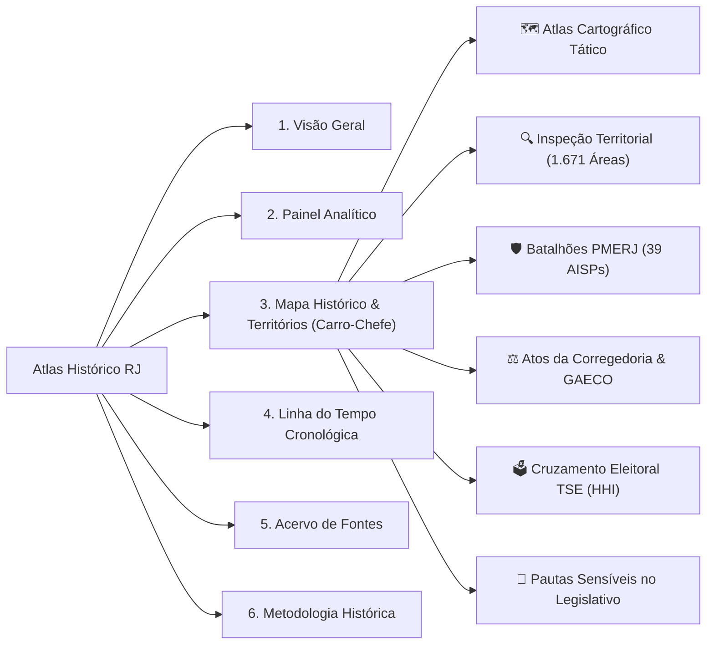

# 🏛️ Atlas Histórico, Territorial e Antropológico da Criminalidade no Rio de Janeiro

[](https://www.python.org/)
[](tests/)
[](https://streamlit.io/)
[](app/map/)
[](database/)
[](data/raw/)
[](#-aviso-ético-e-finalidade)

Projeto multidisciplinar de pesquisa científica, histórica, sociológica e criminológica dedicado a investigar e mapear as dinâmicas de controle territorial armado, governança criminal, mercados ilícitos e instituições públicas no estado do Rio de Janeiro entre **1950 e 2026**.

O projeto alia **rigor historiográfico estrito** (cadeia de custódia com SHA-256, citação textual literal e confrontação de fontes conflitantes) a uma **cartografia moderna de alta performance** baseada em malhas oficiais abertas e processamento vetorial colunar (**GeoParquet + DuckDB/PyArrow**).

---

## 🗺️ O Mapa como Carro-Chefe

A cartografia é o coração analítico da plataforma. A interface substitui painéis convencionais por um **Atlas Editorial com visual escuro tático (*CartoDB Dark Matter*)**, garantindo máxima legibilidade para perímetros territoriais complexos e sobreposição de camadas oficiais:

```text
┌─────────────────────────────────────────────────────────────────────────────────────────────────┐
│  PAINEL DE CONTROLE CARTOGRÁFICO                                                                │
│  [ Basemap: 🌑 Dark Matter ]   [ Motor: Folium / PyDeck 3D ]   [ Camadas: AISP + Favelas + Bairros ]│
├───────────────────────────────────────────────────────┬─────────────────────────────────────────┤
│                                                       │ DOSSIÊ DO REGISTRO SELECIONADO          │
│   MAPA INTERATIVO TÁTICO (TELA CHEIA)                 │                                         │
│                                                       │ [NÍVEL A — OFICIAL / JUDICIAL]          │
│   • 166 Bairros Oficiais (PCRJ / IPP)                 │ [1979] Fundação do NuCOE / BOPE         │
│   • 39 Batalhões PMERJ (AISP / ISP-RJ)                │ Confiabilidade: Confirmado Documental   │
│   • 1.671 Perímetros de Facções & Milícias            │                                         │
│     - ■ Comando Vermelho (CV)                         │ "Criado pelo Boletim da PM nº 014..."   │
│     - ■ Terceiro Comando Puro (TCP)                   │                                         │
│     - ■ Amigos dos Amigos (ADA)                       │ CUSTÓDIA DIGITAL (SHA-256):             │
│     - ■ Liga da Justiça & Milícias                    │ e3b0c44298fc1c149afbf4c8996fb92427...  │
│                                                       │                                         │
│   • Pins Históricos com Selos de Evidência            │ AFIRMAÇÕES & CONTROVÉRSIAS (CLAIMS):    │
│     [🟢 Nível A]  [🔵 Nível B]  [🟡 Nível C]  [🔴 Disputa]│ [APOIA] Histórico Oficial PMERJ         │
├───────────────────────────────────────────────────────┴─────────────────────────────────────────┤
│  ⏱️ LINHA DO TEMPO COM PLAYBACK: [ 1958 ══════════════════════════════════════● 2026 ] [▶ PLAY]   │
│  📥 EXPORTAÇÃO DIRETA: [ Baixar GeoJSON ]  [ Baixar CSV ]                                       │
└─────────────────────────────────────────────────────────────────────────────────────────────────┘
```

---

## ⚡ Principais Funcionalidades da Plataforma

### 1. Visualização Cartográfica Multi-Camadas
* **Tema Escuro Tático (*Dark Matter*):** Fundo preto/cinza grafite de alto contraste que realça a malha viária e as manchas de controle territorial dos grupos armados.
* **Malhas Vetoriais Oficiais Integradas:**
  * **39 Áreas Integradas de Segurança Pública (AISPs):** Limites geográficos oficiais de todos os batalhões da PMERJ (2º BPM a 41º BPM), com sedes, Regiões Integradas (RISP) e municípios.
  * **166 Bairros Oficiais do Rio:** Limites administrativos do Instituto Pereira Passos (IPP / Data.Rio) com Regiões Administrativas e Áreas de Planejamento (AP).
  * **1.671 Perímetros de Comunidades e Favelas:** Base vetorial em padrão RFC 7946 com centroides e codificação de facção hegemônica.
* **Motor Híbrido Folium & PyDeck 3D:**
  * Modo **Folium (Leaflet)**: Interatividade fina com popups enriquecidos, dossiê lateral e renderização clássica.
  * Modo **PyDeck (WebGL / GPU)**: Aceleração de hardware para navegação tridimensional fluida em malhas com milhares de vértices.
* **Linha do Tempo Dinâmica ("Playback Histórico"):** Slider contínuo de anos (1958 a 2026) que permite inspecionar o surgimento progressivo de facções, batalhões e acontecimentos históricos.
* **Exportação Direta de Dados:** Botões integrados na tela para download do recorte filtrado em **GeoJSON** e **CSV**.

### 2. Dossiê Historiográfico Lateral (Selo de Evidência & Custódia)
Ao clicar ou selecionar qualquer acontecimento, abre-se uma ficha documental contendo:
* **Selo de Nível de Evidência:**
  * 🟢 **Nível A (Oficial / Judicial):** Decisões transitadas em julgado, denúncias do GAECO/MPRJ, relatórios de CPIs e publicações no Diário Oficial.
  * 🔵 **Nível B (Acadêmico / Estatístico):** Artigos e teses de centros de pesquisa (UFRJ, UERJ, UFF, ISP-RJ, GENI/UFF, Fogo Cruzado).
  * 🟡 **Nível C (Imprensa Histórica Checada):** Acervo da Hemeroteca Digital da Biblioteca Nacional e reportagens investigativas corroboradas.
  * 🔴 **Conflitante (Divergência Historiográfica):** Casos em que versões oficiais ou acadêmicas colidem.
* **Custódia Criptográfica:** Hash **SHA-256** do documento de suporte e link da fonte original.
* **Decomposição em Claims Atômicos:** Cada proposição factual é atestada por fontes que assumem posturas historiográficas expressas: `[APOIA]`, `[CONTESTA]` ou `[MATIZA]`.
* **Citações Literais Textuais:** Trechos originais transcritos entre aspas com indicação de página ou seção.

### 3. Módulos de Investigação Especializada
* **⚖️ O Desafio do "Arrego" (Evidências Formais da Corregedoria e GAECO):**  
  Base catalogada com grandes operações contra desvios de conduta e corrupção policial militar (*Operação Calabar, Quarto Elemento, Os Intocáveis, Gárgula, Subúrbio, Fim da Linha*), vinculando número de processo judicial, batalhões afetados e hash SHA-256.
* **🗳️ Cruzamento Eleitoral (TSE x AISP / Batalhões):**  
  *Spatial Join* entre colégios eleitorais do Rio e as áreas de batalhão, com cálculo automatizado do **Índice Herfindahl-Hirschman (HHI)**:
  $$\text{HHI} = \sum_{i=1}^{n} s_i^2$$
  Detecção objetiva de anomalias de votação em territórios controlados por grupos armados (alerta de *curral eleitoral* para $\text{HHI} \ge 6.000$ ou candidato dominante $\ge 70\%$).
* **📜 Classificador Legislativo de Pautas Sensíveis (CMRJ / ALERJ):**  
  Motor de processamento de linguagem natural (NLP) baseado na taxonomia dos **5 eixos de negócios do crime organizado**:
  1. *Transporte complementar e alternativo* (vans, kombis e mototáxis).
  2. *Uso e ocupação do solo urbano* (desafetação, anistia a loteamentos e entraves a demolição em áreas de grilagem).
  3. *Monopólios de utilidades* (gás GLP, água mineral e internet comunitária).
  4. *Comércio de sucata e reciclagem* (ferros-velhos e receptação de fios de cobre).
  5. *Moções de aplauso e condecorações* (homenagens a agentes posteriormente investigados).  
  *Inclui Testador Interativo de Proposições em tempo real.*

---

## 🏛️ As 6 Seções do Atlas



1. **Visão Geral:** Introdução institucional, recortes temáticos, métricas globais e guia de navegação.
2. **Painel Analítico:** Distribuição cronológica, proporção de facções, índices de resolução e cumprimento da Regra 1 (Zero Comprovado vs. NULL).
3. **Mapa Histórico & Territórios:** O carro-chefe do projeto com mapas Dark/3D, camadas oficiais de AISP/Bairros/Favelas e as ferramentas de investigação do arrego, votos e leis.
4. **Linha do Tempo Cronológica:** Visualização editorial agrupada por décadas (1950 a 2026) destacando marcos históricos.
5. **Acervo de Fontes:** Biblioteca catalográfica completa com mais de 180 fontes, busca em texto integral, filtro por 25 eixos e fichamento ABNT.
6. **Metodologia Histórica:** Os 6 pilares de rigor historiográfico, equações de cálculo e salvaguardas epistemológicas.

---

## 📊 Estado Atual do Acervo e Banco de Dados

| Dimensão | Quantitativo Auditado | Padrão Metodológico |
| :--- | :---: | :--- |
| **Acontecimentos Históricos Documentados** | **46 eventos** | 100% com fontes e citações literais |
| **Fontes Historiográficas e Jurídicas** | **188 referências** | 25 eixos temáticos e custody sidecars |
| **Polígonos de Comunidades e Facções** | **1.671 áreas** | GeoJSON RFC 7946 e GeoParquet |
| **Batalhões da PMERJ Mapeados (AISP)** | **39 áreas** | Malha oficial ISP-RJ (100% do estado) |
| **Bairros Oficiais do Rio de Janeiro** | **166 bairros** | Cartografia oficial PCRJ / IPP |
| **Operações de Corregedoria / GAECO** | **6 grandes ações** | Processos judiciais e hashes SHA-256 |
| **Locais de Votação com Índice HHI** | **Auditados** | Spatial join via Point-in-Polygon |
| **Proposições Legislativas Classificadas** | **CMRJ & ALERJ** | Taxonomia dos 5 eixos econômicos |
| **Testes Automatizados de Regressão** | **54 aprovados** | Pytest (cobertura total de UI, dados e DQ) |

---

## 📂 Arquitetura do Repositório

```text
├── database/
│   ├── aisps_batalhoes.geojson          # Polígonos das 39 AISPs da PMERJ
│   ├── aisps_batalhoes.parquet          # Malha compacta de AISPs (PyArrow)
│   ├── bairros_rio.geojson              # Polígonos dos 166 bairros oficiais do Rio
│   ├── bairros_rio.parquet              # Malha colunar compacta de bairros
│   ├── locais_votacao_rio.parquet       # Colégios eleitorais com coordenadas, AISP e HHI
│   ├── ocorrencias_corregedoria.json    # Eventos judiciais de arrego/desvios com SHA-256
│   └── proposicoes_legislativas.csv     # PLs coletados da CMRJ/ALERJ classificados
│
├── app/
│   ├── ui/
│   │   └── app.py                       # Aplicação Streamlit (Atlas Editorial)
│   ├── map/
│   │   ├── styles.py                    # Tema Dark Matter, paletas e selos de evidência
│   │   ├── layers.py                    # Loaders com cache para GeoJSON e GeoParquet
│   │   └── builder.py                   # Construtores de Folium (Dark) e PyDeck 3D
│   ├── models/                          # Modelos relacionais do banco (SQLAlchemy)
│   └── services/                        # Camada de serviços (DataService, EventService)
│
├── scripts/
│   ├── etl_tse_votacao.py               # Spatial Join TSE x AISP e cálculo do HHI
│   ├── scraper_camara_rj.py             # Pipeline de extração legislativa
│   ├── classifier_pautas.py             # Classificador NLP das pautas sensíveis
│   └── geospatial/
│       └── extract_official_layers.py   # Ingestão de dados do Data.Rio e ISP-RJ
│
├── tests/
│   ├── test_official_geospatial_layers.py            # Testes das camadas de AISP e Bairros
│   ├── test_electoral_and_legislative_pipelines.py   # Testes de HHI, Corregedoria e NLP
│   ├── test_architectural_foundations.py             # Invariantes temporais e epistêmicos
│   └── test_ui_views.py                              # Testes de renderização da interface
│
└── data/
    ├── rio_historico.db                 # Banco relacional SQLite principal
    └── geospatial/                      # Malhas vetoriais e metadados com SHA-256
```

---

## 🚀 Instalação e Execução Rápida

### 1. Clonar o Repositório e Ativar o Ambiente

```powershell
git clone https://github.com/dixmene/rio-criminalidade-historica.git
cd rio-criminalidade-historica

# Criar e ativar o ambiente virtual
python -m venv .venv
.\.venv\Scripts\Activate.ps1

# Instalar dependências
pip install -r requirements.txt
```

### 2. Rodar a Suíte de Testes Automatizados (54 Testes)

```powershell
python -m pytest -v
```

### 3. Iniciar o Painel Cartográfico Interativo

```powershell
streamlit run app/ui/app.py
```
*O Atlas abrirá automaticamente no seu navegador em `http://localhost:8501`.*

---

## 🔭 Roadmap: Possíveis Melhorias e Próximas Evoluções

Para as próximas etapas de pesquisa e desenvolvimento:

1. **Série Temporal Completa ISP-RJ (2003–2026 por Batalhão):**
   - Ingerir a série mensal de homicídios dolosos, letalidade violenta, mortes por intervenção de agentes do Estado e apreensões de fuzis agregadas por AISP.
   - Gerar gráficos temporais sincronizados com o clique em qualquer batalhão no mapa.
2. **Integração com API do Fogo Cruzado & GENI/UFF:**
   - Adicionar camada opcional de mapas de calor de tiroteios e disparos georreferenciados.
   - Incorporar a evolução histórica anual das manchas do *Mapa dos Grupos Armados* (2006 a 2024).
3. **Módulo de Análise de Disparidade de Atuação Policial:**
   - Cruzar operações policiais em áreas de diferentes facções dentro do mesmo batalhão para gerar métricas objetivas de assimetria operacional.
4. **Extração Automática Contínua do Diário Oficial da ALERJ/CMRJ:**
   - Webhooks ou rotinas agendadas para alertar novas proposições de lei que incidam sobre os 5 eixos de negócios do crime.
5. **Busca Semântica Vetorial (RAG / Embeddings no Acervo):**
   - Inserir busca por similaridade semântica nos PDFs dos documentos históricos usando embeddings locais.

---

## ⚖️ Aviso Ético e Finalidade

Este projeto possui finalidade **estritamente acadêmica, historiográfica e de pesquisa sociológica**.
* **Não** constitui ferramenta de inteligência policial operacional.
* **Não** realiza predições criminais nem indica alvos.
* **Não** imputa condutas criminais sem prévia decisão judicial transitada em julgado.
* As análises eleitorais e legislativas utilizam métricas abertas (HHI e incidência setorial) como **hipóteses de convergência temática**, preservando a distinção entre correlação estatística e causalidade penal.

---

**Registro de Versão**: Setembro de 2026 | Branch `preview-designer` | 54/54 Testes Aprovados
