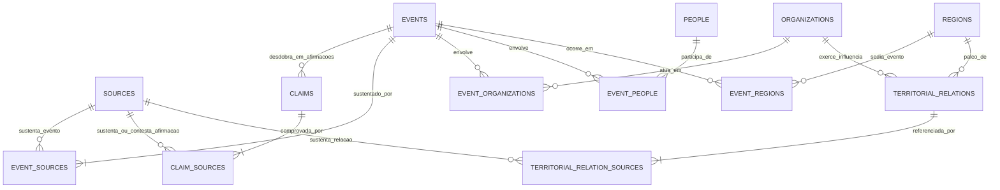

# 🏛️ Arquitetura de Dados Auditada e Modelo Entidade-Relacionamento (ERD)

**Projeto**: Pesquisa Histórica e Territorial da Criminalidade no Rio de Janeiro (1950–2026)  
**Status**: Auditado e Implementado  
**Qualidade Técnica**: 26/26 Testes Automatizados Aprovados (`pytest -v`)  

---

## 1. Diagrama Entidade-Relacionamento Completo (Mermaid)



---

## 2. Os Seis Pilares da Auditoria de Fundação

### Pilar 1: Modelo Epistemológico de Afirmações (`Claim` e `ClaimSource`)

Em historiografia e criminologia crítica fluminense, eventos complexos raramente possuem uma verdade consensual monolítica. O modelo tradicional `EVENTO → FONTE` força o pesquisador a escolher artificialmente qual fonte "venceu".

O novo modelo decompõe o conhecimento histórico em **Proposições Factualmente Auditáveis (`claims`)**:

```text
EVENTO HISTÓRICO
      │
      ▼
CLAIM (Afirmação Específica)
      │
      ├──► FONTE A (Postura: 'apoia', Página X, Trecho literal Y)
      ├──► FONTE B (Postura: 'contesta', Página W, Trecho literal Z)
      └──► FONTE C (Postura: 'matiza', Seção K, Trecho literal J)
```

- **Posturas das Fontes**: `apoia`, `contesta`, `matiza`, `menciona`.
- **Controvérsia Historiográfica**: Flag booleano `is_disputed=True` e campo `epistemological_notes` para registro crítico da divergência.
- **Avaliação da Fonte (`source_assessment`)**: Classificação da natureza do documento (`oficial_policial`, `academica`, `jornalistica_independente`, `testemunho_oral`, `pericial_judicial`).

---

### Pilar 2: Modelo Temporal Rigoroso (Intervalos de Conhecimento)

A temporalidade no banco de dados não utiliza strings genéricas nem cria falsa exatidão:

| Campo | Tipo | Função Metodológica |
| :--- | :---: | :--- |
| `date_display` | `String` | Grafia exata da fonte (*"em 1978"*, *"maio de 1982"*, *"17/09/1979"*). |
| `date_start` | `Date` (SQL) | Baliza temporal inicial do intervalo de conhecimento. |
| `date_end` | `Date` (SQL) | Baliza temporal final do intervalo de conhecimento. |
| `temporal_precision` | `String` | Precisão documentada: `dia`, `mes`, `ano`, `decada`, `intervalo`, `aproximado`. |
| `date_is_estimated` | `Boolean` | Flag indicando se as balizas foram inferidas historiograficamente. |
| `exact_date` | `Boolean` | True apenas se dia, mês e ano forem categoricamente documentados. |

**Exemplo Prático**:
- Fonte: *"Ocorrido durante o ano de 1978"*.
- `date_display`: `"1978"`
- `date_start`: `1978-01-01`
- `date_end`: `1978-12-31`
- `temporal_precision`: `"ano"`
- `date_is_estimated`: `True`
- Permite consultas de sobreposição temporal sem afirmar falsamente que o fato ocorreu no dia 1º de janeiro.

---

### Pilar 3: Proveniência Granular em `EventSource`

Para cada documento vinculado a um evento, é registrado o contexto estrito da sustentação:
- `page`: Número da página.
- `section`: Capítulo, tomo, anexo ou folha judicial.
- `excerpt`: Citação textual literal obrigatória ($\ge 10$ caracteres).
- `claim`: Síntese da proposição factual sustentada pela citação.
- `source_assessment`: Avaliação crítica do documento.
- `confidence_level`: Nível de validação **na própria ligação com a fonte** (`confirmado`, `provavel`, `conflitante`, `nao_verificado`), e não apenas no evento de forma agregada.

---

### Pilar 4: Ausência de Informação e Regra `NULL ≠ 0`

- Remoção de qualquer default artificial no modelo `Region`:
  - `municipality = Column(String, nullable=True, default=None)`
- Se a fonte não informa o município ou coordenada geográfica:
  - O banco de dados armazena estritamente `NULL`.
  - `has_coordinates` avalia como `False` e o evento é listado na seção de "Incerteza Geográfica Documentada", sem marcadores fictícios no mapa.

---

### Pilar 5: Geografia Evolutiva e Prontidão para PostGIS

As regiões e territórios estão estruturados para representar a mudança espacial ao longo das décadas:
- `geometry_type`: `Point`, `Polygon`, `MultiPolygon`.
- `geometry_source`: Órgão ou projeto responsável pelo perímetro (`IPP Sabren`, `dadosderiscos`, `IBGE`, `GENI/UFF`).
- `geometry_confidence`: Nível de confiabilidade cartográfica (`alta`, `media`, `baixa`).
- `geometry_valid_from`: Data inicial da validade histórica deste perímetro específico.
- `geometry_valid_to`: Data final da validade histórica (ex: expansões ou divisões de favelas).
- `geojson_boundary`: Armazenamento de polígonos GeoJSON (RFC 7946), 100% interoperável com PostGIS (`ST_GeomFromGeoJSON`).

---

### Pilar 6: Integração da Base Vetorial de 1.671 Polígonos

- **Arquivo GeoJSON**: `data/geospatial/faccoes_rj_1671_poligonos.geojson` (4.6 MB)
- **Custódia Digital**: `data/geospatial/faccoes_rj_1671_meta.json` (SHA-256)
- **Distribuição de Controle Territorial**:
  - Comando Vermelho (CV): 1.000 áreas (59,8%)
  - Terceiro Comando Puro (TCP): 295 áreas (17,7%)
  - Liga da Justiça (LJ / CL220): 130 áreas (7,8%)
  - Amigos dos Amigos (ADA): 92 áreas (5,5%)
  - Outras Milícias: 91 áreas (5,4%)
  - Milícia de Nova Iguaçu (MNI): 42 áreas (2,5%)
  - Áreas Neutras: 21 áreas (1,3%)
- **Camada no Streamlit**: Aba dedicada `🏴 Mapeamento Territorial (1.671 Áreas)` com filtro dinâmico, autocomplete de busca por comunidade, centroides calculados e download de dados em CSV.

---

## 3. Dicionário de Entidades Atualizado

### 1. `claims` (Afirmações e Proposições Factualmente Auditáveis)
* `id` (PK, INT)
* `event_id` (FK -> `events.id`, INT, NOT NULL)
* `claim_type` (VARCHAR 50, NOT NULL) — `fato`, `data`, `autoria`, `territorio`, `baixa_letal`, `motivacao`
* `statement` (TEXT, NOT NULL) — Enunciado factual auditável
* `confidence_level` (VARCHAR 30, NOT NULL) — `confirmado`, `provavel`, `conflitante`, `nao_verificado`
* `is_disputed` (BOOLEAN, NOT NULL, DEFAULT FALSE) — Flag de divergência historiográfica
* `epistemological_notes` (TEXT, NULL) — Análise crítica da divergência
* `is_demo` (BOOLEAN, NOT NULL, DEFAULT FALSE)
* `created_at` (TIMESTAMP)

### 2. `claim_sources` (Posturas das Fontes perante as Afirmações)
* `id` (PK, INT)
* `claim_id` (FK -> `claims.id`, INT, NOT NULL)
* `source_id` (FK -> `sources.id`, INT, NOT NULL)
* `stance` (VARCHAR 30, NOT NULL) — `apoia`, `contesta`, `matiza`, `menciona`
* `page` (VARCHAR 50, NULL)
* `section` (VARCHAR 100, NULL)
* `excerpt` (TEXT, NOT NULL) — Citação literal comprovando a postura
* `source_assessment` (VARCHAR 100, NULL)
* `assessment_notes` (TEXT, NULL)
* `confidence_level` (VARCHAR 30, NOT NULL)
* `created_at` (TIMESTAMP)

### 3. `events` (Eventos Históricos)
* `id` (PK, INT)
* `title` (VARCHAR 255, NOT NULL)
* `event_type` (VARCHAR 100, NOT NULL)
* `date_display` (VARCHAR 100, NOT NULL) — Grafia textual literal
* `date_start` (DATE, NULL) — Baliza temporal inicial
* `date_end` (DATE, NULL) — Baliza temporal final
* `year` (INT, NULL) — Ano para timeline
* `temporal_precision` (VARCHAR 50, NOT NULL) — `dia`, `mes`, `ano`, `decada`, `intervalo`, `aproximado`
* `exact_date` (BOOLEAN, NOT NULL) — True apenas se dia exato
* `date_is_estimated` (BOOLEAN, NOT NULL, DEFAULT FALSE) — True se baliza estimada
* `description` (TEXT, NOT NULL)
* `historical_context` (TEXT, NULL)
* `confidence_level` (VARCHAR 30, NOT NULL)
* `is_demo` (BOOLEAN, NOT NULL)
* `created_at` (TIMESTAMP)

### 4. `event_sources` (Proveniência de Eventos)
* `id` (PK, INT)
* `event_id` (FK -> `events.id`, INT, NOT NULL)
* `source_id` (FK -> `sources.id`, INT, NOT NULL)
* `page` (VARCHAR 50, NULL)
* `section` (VARCHAR 100, NULL)
* `page_or_section` (VARCHAR 100, NULL)
* `excerpt` (TEXT, NOT NULL) — Citação literal comprobatória
* `claim` (TEXT, NULL) — Afirmação sustentada
* `source_assessment` (VARCHAR 100, NULL)
* `assessment_notes` (TEXT, NULL)
* `confidence_level` (VARCHAR 30, NOT NULL)
* `validation_status` (VARCHAR 30, NOT NULL)
* `confidence_notes` (TEXT, NULL)
* `created_at` (TIMESTAMP)

### 5. `regions` (Territórios e Geometrias)
* `id` (PK, INT)
* `original_name` (VARCHAR 255, NOT NULL)
* `normalized_name` (VARCHAR 255, NOT NULL)
* `region_type` (VARCHAR 100, NOT NULL)
* `municipality` (VARCHAR 100, NULL, DEFAULT NULL) — Sem default artificial
* `latitude` (FLOAT, NULL) — Sem coordenadas inventadas
* `longitude` (FLOAT, NULL)
* `location_precision` (VARCHAR 50, NOT NULL) — `exata`, `aproximada`, `centroide`, `desconhecida`
* `geometry_type` (VARCHAR 50, NULL) — `Point`, `Polygon`, `MultiPolygon`
* `geometry_source` (VARCHAR 100, NULL) — Origem do perímetro
* `geometry_confidence` (VARCHAR 50, NULL) — `alta`, `media`, `baixa`
* `geometry_valid_from` (DATE, NULL) — Validade histórica inicial do perímetro
* `geometry_valid_to` (DATE, NULL) — Validade histórica final do perímetro
* `geojson_boundary` (TEXT, NULL)
* `description` (TEXT, NULL)
* `is_demo` (BOOLEAN, NOT NULL)
* `created_at` (TIMESTAMP)
