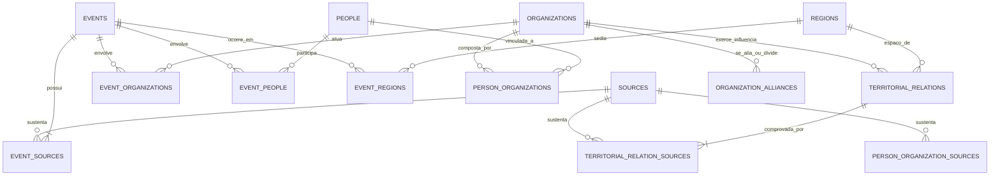

# Proposta de Arquitetura e Modelo Relacional de Dados (ERD)

---

## 1. Visão Geral do Modelo de Dados

O modelo relacional foi projetado para garantir **normalização, rastreabilidade de fontes, temporalidade de relações e suporte geoespacial (PostgreSQL / PostGIS / SQLite SpatiaLite)**.

---

## 2. Dicionário de Entidades Principais

### 1. `sources` (Biblioteca de Fontes)
* `id` (PK, SERIAL/INT)
* `title` (VARCHAR 255)
* `citation` (TEXT) — Citação bibliográfica formal (ABNT/Chicago)
* `author` (VARCHAR 255)
* `publisher` (VARCHAR 255)
* `source_type` (VARCHAR 100) — `academico_tese`, `jornalismo_investigativo`, `oficial_relatorio`, `documento_judicial`, etc.
* `publication_date` (DATE/VARCHAR)
* `document_date` (DATE/VARCHAR)
* `url` (VARCHAR 500)
* `archive_ref` (VARCHAR 255) — Fundo de acervo / pasta / caixa
* `file_hash_sha256` (VARCHAR 64) — Hash criptográfico do arquivo em `data/raw/`
* `reliability_rating` (INT 1-5)
* `notes` (TEXT)
* `is_demo` (BOOLEAN)
* `created_at` (TIMESTAMP)

### 2. `organizations` (Grupos, Facções, Milícias, Órgãos Estatais)
* `id` (PK, INT)
* `original_name` (VARCHAR 255) — ex: "Comando Vermelho Rogério Lemgruber"
* `normalized_name` (VARCHAR 255) — ex: "COMANDO VERMELHO ROGERIO LEMGRUBER"
* `acronym` (VARCHAR 50) — ex: "CV", "TCP", "ADA"
* `org_type` (VARCHAR 100) — `faccao_criminosa`, `milicia`, `policial`, `orgao_estatal`, `sindicato`, `sociedade_civil`
* `foundation_year` (INT, NULL se desconhecido)
* `dissolution_year` (INT, NULL se ativa ou desconhecido)
* `description` (TEXT)
* `is_demo` (BOOLEAN)

### 3. `people` (Lideranças, Integrantes, Agentes Estatais, Vítimas)
* `id` (PK, INT)
* `original_name` (VARCHAR 255) — ex: "Rogério Lemgruber"
* `normalized_name` (VARCHAR 255) — ex: "ROGERIO LEMGRUBER"
* `aliases` (VARCHAR 255) — Alcunhas / codinomes
* `role_description` (VARCHAR 255) — Papel histórico geral
* `birth_year` (INT, NULL se desconhecido)
* `death_year` (INT, NULL se vivo ou desconhecido)
* `notes` (TEXT)
* `is_demo` (BOOLEAN)

### 4. `regions` (Territórios, Bairros, Favelas, Complexos, Municípios)
* `id` (PK, INT)
* `original_name` (VARCHAR 255) — ex: "Complexo do Alemão"
* `normalized_name` (VARCHAR 255) — ex: "COMPLEXO DO ALEMAO"
* `region_type` (VARCHAR 100) — `complexo`, `favela`, `bairro`, `municipio`, `zona`
* `municipality` (VARCHAR 100) — default "Rio de Janeiro"
* `latitude` (FLOAT) — Centróide de referência
* `longitude` (FLOAT) — Centróide de referência
* `geojson_boundary` (TEXT / GEOMETRY PostGIS) — Polígono de fronteiras
* `description` (TEXT)
* `is_demo` (BOOLEAN)

### 5. `events` (Acontecimentos Históricos)
* `id` (PK, INT)
* `title` (VARCHAR 255)
* `event_type` (VARCHAR 100) — `fundacao`, `cisao`, `alianca`, `conflito`, `operacao_policial`, `prisao`, `morte`, `ocupacao`, `mudanca_territorial`
* `date_start` (VARCHAR 50) — YYYY-MM-DD ou YYYY
* `date_end` (VARCHAR 50, NULL se pontual)
* `year` (INT) — Ano de referência para indexação e linha do tempo
* `exact_date` (BOOLEAN) — True se dia exato for conhecido
* `description` (TEXT)
* `historical_context` (TEXT)
* `confidence_level` (VARCHAR 30) — `confirmado`, `provavel`, `conflitante`, `nao_verificado`
* `is_demo` (BOOLEAN)

---

## 3. Tabelas de Vínculos e Proveniência Estrita

* **`event_sources`**: Vínculo obrigatório entre evento e fonte.
  * `event_id`, `source_id`, `page_or_section`, `excerpt` (trecho comprobatório), `claim_assertion`, `validation_status`, `confidence_notes`.
* **`territorial_relations`**: Histórico da ocupação territorial ao longo do tempo.
  * `organization_id`, `region_id`, `date_start`, `date_end`, `relation_type` (`dominio_hegemonico`, `disputa_ativa`, `presenca_documentada`, `mudanca_de_controle`), `confidence_level`.
* **`territorial_relation_sources`**: Proveniência de cada relação territorial.
  * `territorial_relation_id`, `source_id`, `page_or_section`, `excerpt`, `validation_status`.
* **`person_organizations`**: Trajetória das lideranças dentro das organizações.
  * `person_id`, `organization_id`, `role_type` (`fundador`, `lideranca_documentada`, `integrante`, `dissidente`), `start_year`, `end_year`.
* **`event_organizations`**: `event_id`, `organization_id`, `role_in_event`.
* **`event_people`**: `event_id`, `person_id`, `role_in_event`.
* **`event_regions`**: `event_id`, `region_id`, `specific_location_name`.
* **`organization_alliances`**: Relações inter-organizacionais (`alianca`, `cisao`, `guerra_declarada`), com `start_date`, `end_date` e fontes.
