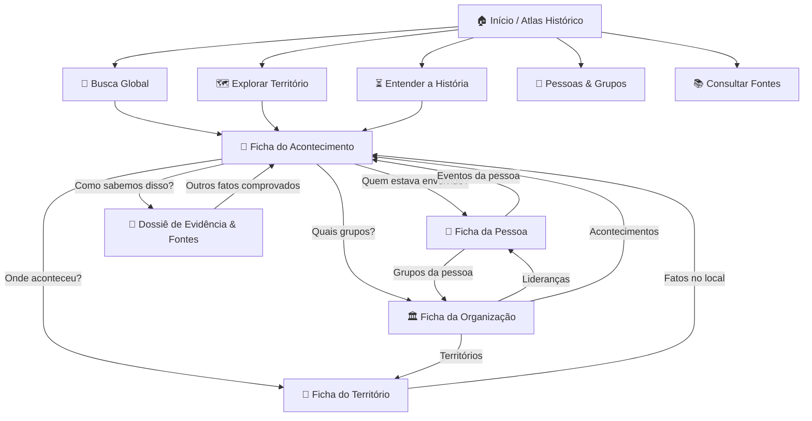

# 🏛️ AUDITORIA UX TELA POR TELA & NOVA ARQUITETURA DA INFORMAÇÃO
**Projeto Rio Criminalidade Histórica**  
**Escopo**: Avaliação da branch `preview-designer` sob a perspectiva de dois perfis:
1. *Primeiro Visitante Leigo / Cidadão Interessado* (precisa de clareza, contexto e linguagem natural sem fricção técnica).
2. *Pesquisador Acadêmico / Historiador* (precisa de verificação de evidência, proveniência estrita e cruzamento relacional).

---

## 🧭 1. Diagnóstico Geral: A Transição de Modelo Mental

| Modelo Atual (Centrado no Sistema) | Novo Modelo Proposto (Centrado na Descoberta do Usuário) |
| :--- | :--- |
| *"Aqui estão as funções do nosso software"* | *"O que você quer descobrir sobre o Rio de Janeiro?"* |
| Abas técnicas: Visão Geral, Atlas, Timeline, Fontes, Metodologia | Rotas temáticas: Território, História, Pessoas & Grupos, Lugares, Fontes, Busca Global |
| Vocabulário de banco de dados (`Claim`, `confidence_level`, `is_demo`) | Linguagem em duas camadas: *Camada 1 (Humana)* + *Camada 2 (Evidência Acadêmica)* |
| Dados desconectados em silos (tabelas e listas isoladas) | **Grafo Relacional Clicável**: Evento ↔ Pessoa ↔ Organização ↔ Lugar ↔ Fonte |
| Mapa estático com polígonos coloridos | **Mapa Investigativo**: responde a perguntas contextuais por período temporal |
| Timeline como lista cronológica crua | **Narrativa Histórica**: introdução contextual do período antes da lista de fatos |

---

## 🔍 2. Auditoria UX Tela por Tela (Os 5 Níveis de Análise)

Avaliamos cada tela atual da `preview-designer` segundo os 5 níveis:
1. **Clareza** (*Entendo o que o site é?*)
2. **Descoberta** (*Sei o que posso fazer aqui?*)
3. **Navegação** (*Consigo encontrar e transitar entre informações?*)
4. **Compreensão** (*Entendo o que estou lendo sem jargão de software?*)
5. **Evidência** (*Consigo checar a autenticidade e a fonte sem barreiras?*)

---

### TELA 1: Início / "Visão Geral"

* **Nota Geral**: 6.5 / 10
* **O que confunde**:
  - A tela se apresenta com uma mentalidade de relatório institucional ou dashboard executivo.
  - A faixa estatística (`36 acontecimentos · 182 fontes...`) é visualmente agradável, mas não convida o usuário à ação.
  - O seletor de "Modo de Isolamento (`[DEMO]`)" na barra lateral polui a experiência de 99% dos usuários que querem apenas ver a história real.
* **O que falta**:
  - Abertura editorial no formato de livro/atlas (*"ATLAS HISTÓRICO — Rio de Janeiro (1950–2026)"*).
  - Três portas de entrada diretas e grandes para ação imediata:
    1. `[ 🗺️ Explorar o Mapa ]`
    2. `[ ⏳ Percorrer a História ]`
    3. `[ 🔎 Pesquisar no Acervo ]`
  - Guia visual de 4 passos simples: *Como usar este atlas* (1. Escolha um período → 2. Explore o território → 3. Abra um acontecimento → 4. Consulte a evidência).
* **O que deve desaparecer**:
  - A terminologia técnica "Modo de Isolamento de Teste" na sidebar principal (deve ser movida para configurações avançadas de auditoria).
* **Como deve funcionar**:
  - **Camada 1**: Título imponente, resumo em dois parágrafos, 3 botões de ação e guia ilustrado de 4 passos.
  - **Camada 2**: Resumo do projeto científico, aviso ético legal e nota metodológica sobre a custódia de fontes.

---

### TELA 2: "Atlas Cartográfico"

* **Nota Geral**: 6.0 / 10
* **O que confunde**:
  - O mapa mostra pinos e polígonos, mas o usuário não sabe imediatamente **o que aqueles polígonos significam temporalmente** (os 1.671 polígonos representam a distribuição atual/recente, enquanto os pinos históricos vão de 1958 a 2026).
  - O usuário seleciona um evento em uma caixa de seleção longa com dezenas de títulos, em vez de clicar organicamente no território ou filtrar por perguntas.
* **O que falta**:
  - O mapa precisa **responder a uma pergunta histórica contextual**:
    > *"O que você está vendo em 1970–1979?"*  
    > *Mostrando as prisões na Ilha Grande, as primeiras ações na Guanabara e os esquadrões da Scuderia Le Cocq.*
  - Ficha de território com dados compreensíveis:
    - *Nome do Lugar*: Ilha Grande / Colônia Penal Cândido Mendes
    - *Período Documentado*: 1970–1994
    - *O que aconteceu aqui*: Texto simples em 3 linhas.
    - *Quem esteve aqui*: Links clicáveis para `William da Silva Lima`, `Rogério Lemgruber`, `Comando Vermelho`.
    - *Fontes*: "3 fontes documentadas" → Botão `[ Ver Evidências ]`.
* **O que deve desaparecer**:
  - Jargões internos como `confidence_level: confirmado` sem explicação do critério; substituir por texto amigável *"Fato Documentado em Múltiplas Fontes"* ou *"Controvérsia Historiográfica"*.
* **Como deve funcionar**:
  - Linha temporal no topo que ajusta os pontos exibidos.
  - Ao clicar em um pino ou território, o dossiê lateral divide-se em:
    - **Aba Resumo** (O que é, quem estava lá, resumo dos fatos).
    - **Aba Evidência** (Citações textuais entre aspas, página do livro, hash SHA-256 e postura das fontes).

---

### TELA 3: "Linha do Tempo"

* **Nota Geral**: 5.5 / 10
* **O que confunde**:
  - Atualmente é uma lista cronológica de eventos com um ponto e ano, parecendo um feed ou log de eventos técnicos.
  - Não há fio narrativo: o usuário pula de 1962 (Mineirinho) para 1964 (Cara de Cavalo) e 1969 (Lei de Segurança Nacional) sem entender a transição histórica entre a ditadura militar, o esquadrão da morte e o sistema carcerário.
* **O que falta**:
  - **Periodização Historiográfica Narrativa**. Antes de listar os eventos de um período, deve haver um **quadro de síntese histórica**:
    - **1950–1969: A Era dos Esquadrões da Morte e a Ditadura Militar**  
      *Síntese*: O surgimento da Scuderia Le Cocq na Guanabara, as perseguições policiais mediatizadas e a promulgação da Lei de Segurança Nacional que misturou presos comuns e políticos.
    - **1970–1989: A Gênese Prisional e o Monopólio do Bicho**  
      *Síntese*: O caldeirão da Ilha Grande, a fundação da Falange Vermelha/CV, a consolidação da cúpula do bicho com a LIESA e o cerco cinematográfico do Morro do Juramento.
    - **1990–1999: A Fragmentação Faccional e a Supermáxima**  
      *Síntese*: Cisões no tráfico, surgimento do Terceiro Comando (TC) e Amigos dos Amigos (ADA), inauguração de Bangu 1 e demolição do presídio de Dois Rios.
    - **2000–2009: A Ascensão Paramilitar das Milícias**  
      *Síntese*: A expansão da Liga da Justiça na Zona Oeste, a CPI das Milícias na ALERJ e a formalização do BOPE.
    - **2010–2018: A Era das UPPs e a Intervenção Federal**  
      *Síntese*: Ocupação do Alemão, crise fiscal e segurança pública, assassinato de Marielle Franco e intervenção federal militar.
    - **2019–2026: Complexo de Israel, ADPF das Favelas e Julgamentos**  
      *Síntese*: Fracionamento territorial moderno, emergência do narcomilicianismo e sentença histórica no STF.
* **O que deve desaparecer**:
  - Listagem corrida em tabela crua como visão primária. A tabela de dados deve ser opcional para quem quer exportar CSV.
* **Como deve funcionar**:
  - Navegador por épocas com cartões de contexto + acontecimentos com botões diretos para o dossiê da evidência.

---

### TELA 4: "Acervo Documental" (Fontes)

* **Nota Geral**: 7.0 / 10
* **O que confunde**:
  - A tabela mostra 182 fontes, mas para um visitante é difícil saber quais dessas fontes ancoram quais fatos e por onde começar a ler.
* **O que falta**:
  - Agrupamento em **Destaques Bibliográficos Clássicos**:
    - Obras Fundamentais (William da Silva Lima, Carlos Amorim, Michel Misse, Alba Zaluar).
    - Documentos Oficiais & Judiciais (Boletins PMERJ, Sentenças STF, CPI das Milícias).
    - Reportagens Históricas de Hemeroteca (Clarice Lispector 1964, Jornal do Brasil, El País).
  - Cada fonte deve listar imediatamente os **Acontecimentos e Pessoas que ela comprova no banco**, com links clicáveis.
* **Como deve funcionar**:
  - Busca por autor/obra + filtro por tipo de acervo + ficha com trechos transcritos e citação ABNT pronta para cópia acadêmica.

---

### TELA 5: "Metodologia & Dados"

* **Nota Geral**: 6.0 / 10
* **O que confunde**:
  - Mistura conceitos de integridade de dados (Regra 1: Zero vs NULL) com normalização onomástica de strings em um formulário de teste de laboratório.
* **O que falta**:
  - Explicar a metodologia em **termos epistemológicos humanos**:
    - *"Por que não inventamos datas nem coordenadas?"*
    - *"Como tratamos narrativas conflitantes (quando duas fontes confiáveis divergem)?"*
    - *"O que significa cada carimbo de postura historiográfica (Apoia, Contesta, Matiza)?"*
* **Como deve funcionar**:
  - Manifesto de transparência científica com exemplos visuais reais do próprio banco.

---

### O QUE ESTÁ FALTANDO COMPLETAMENTE (Novas Telas Críticas)

1. **🔎 Busca Global Multientidade**:
   - Um campo único onde o usuário digita *"Alemão"*, *"Escadinha"*, *"Ilha Grande"*, *"1979"* ou *"Bicho"* e recebe cards agrupados:
     - 📌 **Acontecimentos** (ex: *Fuga de Escadinha de helicóptero, 1985*)
     - 👥 **Pessoas** (ex: *José Carlos dos Reis Encina - Escadinha*)
     - 🏛️ **Organizações** (ex: *Comando Vermelho*)
     - 📍 **Lugares** (ex: *Morro do Juramento*, *Ilha Grande*)
     - 📚 **Fontes** (ex: *Carlos Amorim, Comando Vermelho, 1993*)
2. **👥 Páginas de Entidade: Pessoas**:
   - Ficha biográfica histórica: Nome histórico, apelido, papel documentado, linha do tempo pessoal, organizações vinculadas, eventos em que esteve presente e citações documentais.
3. **🏛️ Páginas de Entidade: Organizações**:
   - Ficha institucional: Nome oficial, siglas, período de fundação documentado, lideranças históricas associadas, territórios de influência, eventos emblemáticos e controvérsias de origem.
4. **📍 Páginas de Entidade: Territórios / Lugares**:
   - Ficha do lugar: Nome do território, município, bairro, coordenadas documentadas, eventos ocorridos ali, grupos que atuaram na área e fontes específicas.

---

## 🗺️ 3. O Grafo de Navegação Relacional Clicável

Toda a interface deve permitir navegação fluida em teia, sem becos sem saída:

---

## 💎 4. As Duas Camadas de Leitura da Informação

### Camada 1: Para o Cidadão / Primeiro Visitante (Linguagem Direta)
* **Pergunta**: *"O que aconteceu aqui?"*
  - Resposta: Título e síntese factual em 3 linhas sem jargões.
* **Pergunta**: *"Quando isso aconteceu?"*
  - Resposta: Data legível (`Julho de 1979` ou `1958–1962`).
* **Pergunta**: *"Quem estava envolvido?"*
  - Resposta: Chips com nomes de pessoas e grupos, clicáveis para abrir seus perfis.
* **Pergunta**: *"Como sabemos disso?"*
  - Resposta: *"Documentado em 2 fontes bibliográficas. Trecho: '...' "*

### Camada 2: Para o Pesquisador Acadêmico (Acordeão: "Ver Detalhes da Evidência")
* Quando expandido, exibe:
  - Citação ABNT completa da fonte.
  - Número de página, volume, edição e capítulo.
  - Trecho literal original transcrito (`excerpt`).
  - Proposição factual atômica (`Claim`).
  - Postura da fonte perante o fato:
    - `[APOIA]` (Fonte corrobora o fato).
    - `[CONTESTA]` (Fonte apresenta divergência com outra linha historiográfica).
    - `[MATIZA]` (Fonte modula datas, contexto ou números).
  - Hash criptográfico SHA-256 para auditoria de custódia do arquivo digital.
  - Regra de precisão temporal (`HistoricalDate` com precisão de dia/mês/ano/década).
  - Nota de crítica de fonte e limitações documentais.

---

## 🚀 5. Plano de Implementação na Branch `preview-designer`

1. **Reestruturar o Roteamento em `app/ui/app.py`**:
   - Menu lateral guiado por descobertas:
     1. `Início` (Página de abertura do Atlas)
     2. `Explorar o Território` (Mapa com perguntas por época)
     3. `Entender a História` (Linha do tempo narrativa em 6 épocas)
     4. `Pessoas & Organizações` (Explorador biográfico e institucional)
     5. `Lugares & Territórios` (Explorador geográfico)
     6. `Consultar Fontes` (Acervo documental com destaques)
     7. `Busca Global` (Pesquisa multi-entidade)
2. **Implementar o Gerenciador de Estado Relacional (`st.session_state`)**:
   - Permitir que clicar em um botão com o nome de uma pessoa, grupo ou lugar em qualquer tela transicione imediatamente para a respectiva ficha detalhada, com botão de retorno ("← Voltar ao Acontecimento").
3. **Integrar as Duas Camadas de Apresentação**:
   - Fichas com visual limpo de leitura direta + acordeão fechado por padrão com todo o rigor de `Claim`, `HistoricalDate` e `SHA-256`.
4. **Isolar Modos Técnicos (`is_demo`)**:
   - Omitir menções a DEMO da interface pública; manter filtro restrito a uma seção discreta de auditoria metodológica.
